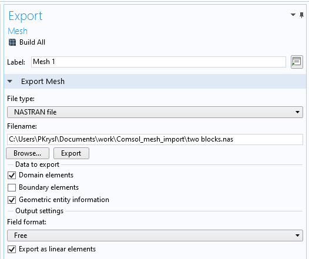

# README
Summary: Import Comsol as FinEtools model, solve the free vibration problem, export  the solution.

## Set up the simulation

### Create the mesh

Use Comsol to create a mesh. Make sure to create materials for each material domain and  assign the material to the domain. The material parameters don't matter: the materials are not exported themselves. Just the mesh. Remember the numbers of the materials (1, 2, ...): the parameter file  will need to refer to these numbers.

### Export  the mesh

Export the mesh as a NASTRAN file. Used the settings shown in this image:


### Create a parameter file

Create the parameter file for the simulation. It is a JSON file with this structure:
```
{
    "meshfile": "twoblocks.nas",
    "neigvs": 20,
    "frequencyshift": 10.0,
    "materials": {
        "2": {
            "name": "aluminum",
            "E": 7.0e10,
            "nu": 0.34,
            "rho": 2700.0
        },
        "1": {
            "name": "steel",
            "E": 2.05e11,
            "nu": 0.3,
            "rho": 7850.0
        }
    }
}
```
Change the parameters appropriately. Materials can be added. Note that the numbers of the materials in the Comsol model are recorded here as strings.

## Run the simulation

## Results

